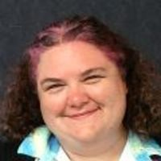

### MCB 536

## Tools for Computational Biology

---

## Today's objectives

- Locate information relevant to the course (lecture materials, assessment, communication streams)
- Identify range of skills and concepts covered in this course

---

## Communication

Slack Workspace: TFCB_2023

- #general: course announcements (please turn on notifications for this channel)
- #lectures-homeworks: questions about course content and help for homework
- see pinned posts in each channel for quick links and reminders

---

## Today's instructor

- Rasi Subramaniam
- Associate Professor in Basic Sciences & Computational Biology @FredHutch
- Research Area: mRNA Translation
- http://rasilab.fredhutch.org/

---

## Teaching assistants & office hours

<table>
<tr>
<td style="padding-right:200px;">
 
</td>
<td>
 
</td>
</tr>
<tr>
<td style="padding-right:200px;">
Nashwa Ahmed
</td>
<td> 
Sarah Huang
</td>
</tr>
<tr>
<td style="padding-right:200px;">
Wed 11AM-12PM
</td>
<td>Thu 2PM-3PM
</td>
</tr>
</table>

Steam Plant Building, Fred Hutch S2-135 (2nd floor)

Zoom (see Slack for link)

---

## Instructors

<table>
<tr>
<td>

</td>
<td>

</td>
<td>

</td>
</tr>
<tr>
<td>
Melody Campbell
</td>
<td>
Phil Bradley
</td>
<td>
Maggie Russell
</td>
</tr>
<tr>
<td>

</td>
<td>

</td>
<td>

</td>
</tr>
<tr>
<td>
Elizabeth Humphries
</td>
<td>
Manu Setty
</td>
<td>
Rasi Subramaniam
</td>
</tr>
</table>

Computational Biology & Translational Data Science Programs

---

## Introduce yourself!

- Name
- Research interests (type of data, model organism, research questions, etc)
- Programming background (Python, R, Unix/Bash, etc.)
- What are you hoping to get out of this course?

---

## Course objectives

By the end of the course, you should be able to:

- Use VSCode to program in Unix/Bash shell, Python, R using appropriate syntax and code convention

- Apply good practices for computational research including project and data organization

- Select appropriate tools to perform specific programming and data analysis tasks

- Analyze common forms of data generated by molecular biology experiments such as flow cytometry, 96-well plate readers, and high throughput sequencing.

---

## What you won't be able to do

- Use ALL of the computational tools your research will require

- Know the best algorithm or analysis method for a specific research question

- Code with expert-level skills

... but you should be equipped to work towards these goals on your own.

<!-- 
- Learn outside class. You will get most benefit if you spend time studying on your own on the internet.
- Learning curve will be steep. Your ability to do things will be limited for a while. This is quite normal.
- You are really learning a new language and also a new way of thinking about problems and solving them. So it will take time to get comfortable.
- Think of this class as a rapid tour through Africa or Europe or South America where everyone speaks a different language than you. You can appreciate what is there, but to be comfortable or get really good, you need to spend lot of time immersed in that culture. 
-->

---

## Course website

Syllabus, lectures, homeworks

Rendered materials (prettier/easier to view):  
https://fredhutch.github.io/tfcb_2023/

Original GitHub repository:
https://github.com/fredhutch/tfcb_2023

---

## Homeworks

Submit through <a href="http://canvas.uw.edu/">Canvas</a>   
MCB 536 A Au 23
Tools For Computational Biology

Eight assignments (10% each) + [participation](https://github.com/FredHutch/tfcb_2022/blob/master/lectures/lecture01/participation_rubric.md) (20%)

---

## Before next class

- Install all required [software](https://github.com/FredHutch/tfcb_2022/blob/master/software/README.md) and be prepared with questions!
